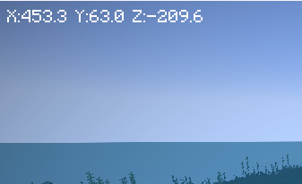

# 座標表示プラグイン

## インストール

* 依存プラグイン
    * [Fabric API](https://www.curseforge.com/minecraft/mc-mods/fabric-api) が必要です

## その他

* [Mod Menu](https://www.curseforge.com/minecraft/mc-mods/modmenu/) で設定変更が可能です
    * 方向表示on/off
    * [Cloth Config](https://www.curseforge.com/minecraft/mc-mods/cloth-config)と合わせてインストールしてください