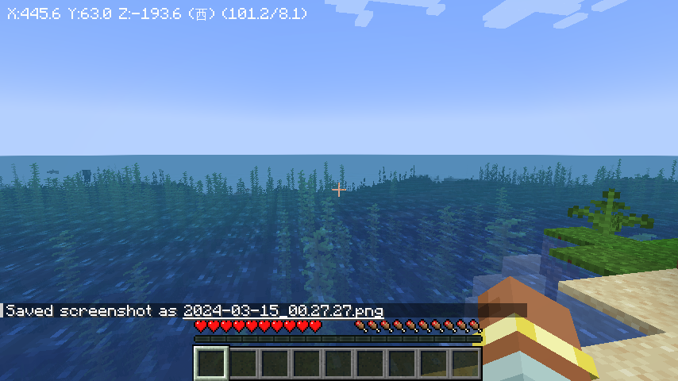

座標表示プラグイン

# インストール

依存プラグイン
* [Fabric API](https://www.curseforge.com/minecraft/mc-mods/fabric-api) が必要です

# その他

[Mod Menu](https://www.curseforge.com/minecraft/mc-mods/modmenu/) で設定変更が可能です
* 表示位置
* 文字色
* 方角表示on/off
* 方向/目線の角度on/off
* [Cloth Config](https://www.curseforge.com/minecraft/mc-mods/cloth-config)と合わせてインストールしてください

# ビルド

Fabric版のビルドは `./gradlew :fabric:build` を実行してください。
