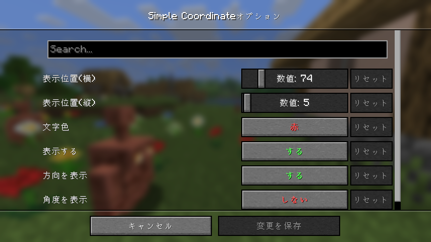

# 座標表示プラグイン

## 対応ローダー

* [Fabric](https://fabricmc.net/)
* [NeoForge](https://neoforged.net/)

## インストール (Fabric)

依存プラグイン

* [Fabric API](https://www.curseforge.com/minecraft/mc-mods/fabric-api)
* [Cloth Config](https://www.curseforge.com/minecraft/mc-mods/cloth-config)

* [Mod Menu](https://www.curseforge.com/minecraft/mc-mods/modmenu/) を追加するとMinecraftのメニュー上で設定が変更できます

## インストール (NeoForge)

依存プラグイン

* [Cloth Config](https://www.curseforge.com/minecraft/mc-mods/cloth-config)

## 設定可能な内容

* 表示位置
* 文字色
* 方角表示on/off
* 方向/目線の角度on/off
