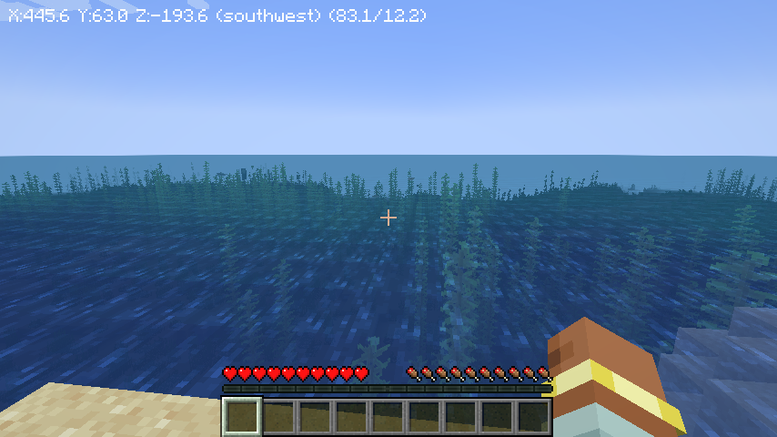

# Simple Coordinates

simple display for Coordinates on HUD.

## Setup

For setup Fabric environment.

## feature

* show coordination, direction, angle, pitch
* toggle on/off by [Mod Menu](https://www.curseforge.com/minecraft/mc-mods/modmenu/) 

## dependencies 
* [Mod Menu](https://www.curseforge.com/minecraft/mc-mods/modmenu/)
* [Cloth Config](https://www.curseforge.com/minecraft/mc-mods/cloth-config)

## License

This template is available under the CC0 license. Feel free to learn from it and incorporate it in your own projects.
